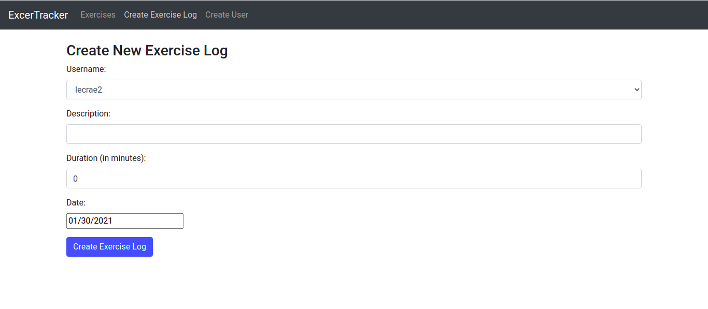

# Exercise Tracker

This is a simple web application built for recording exercises done to show my understanding of
Different development technologies.

## Live Link

[live](https://vast-hollows-24056.herokuapp.com/login)

## Screenshot

## Technologies Used

    - Node.js
    - Mongodb
    - Express
    - React.js

## How to get started with the project

Clone it to your local machine

### Frontend

cd into the root folder of the project
then run

`yarn start`

### Backend

change directory one level deep to backend folder

`cd backend/`

run nodemon server and you are good to go

`nodemon server`

## Author

- Github: [@hillarioh](https://github.com/hillarioh)
- Twitter: [@hillaokri](https://twitter.com/hillaokri)
- Linkedin: [@HillaryOkerio](https://www.linkedin.com/in/hillaryokerio/)

## 🤝 Contributing

Contributions, issues and feature requests are welcome!

## Credit

Original Design idea by [Gregoire Vella on Behance](https://www.behance.net/gregoirevella) .
The design [info](https://www.behance.net/gallery/14286087/Twitter-Redesign-of-UI-details)
